<picture>
  <source media="(prefers-color-scheme: dark) and (max-width: 600px)" srcset="./assets/header-mobile-dark.svg">
  <source media="(prefers-color-scheme: light) and (max-width: 600px)" srcset="./assets/header-mobile-light.svg">
  <source media="(prefers-color-scheme: dark)" srcset="./assets/header-dark.svg">
  <source media="(prefers-color-scheme: light)" srcset="./assets/header-light.svg">
  
</picture>

 

I run [For Creative Works](https://www.forcreativeworks.com), a one-person creative studio in İzmir. The work is brand identity, websites, social content, photography and video.

I'm not a software developer. I design the systems, decide how they should behave, and approve what they produce. Claude Code writes the code. That has turned into the production setup my studio runs on.

### Systems I built for my own work

<picture>
  <source media="(prefers-color-scheme: dark) and (max-width: 600px)" srcset="./assets/card-kora-mobile-dark.svg">
  <source media="(prefers-color-scheme: light) and (max-width: 600px)" srcset="./assets/card-kora-mobile-light.svg">
  <source media="(prefers-color-scheme: dark)" srcset="./assets/card-kora-dark.svg">
  <source media="(prefers-color-scheme: light)" srcset="./assets/card-kora-light.svg">
  
</picture>

Not an assistant that does things for me, but an accountability partner that keeps me doing them. It turns each day into one critical task instead of twenty, checks in morning, noon and evening, and shrinks a stuck task down to the smallest next step. Its core rule: never make things up, never sugarcoat.

 

<picture>
  <source media="(prefers-color-scheme: dark) and (max-width: 600px)" srcset="./assets/card-imece-mobile-dark.svg">
  <source media="(prefers-color-scheme: light) and (max-width: 600px)" srcset="./assets/card-imece-mobile-light.svg">
  <source media="(prefers-color-scheme: dark)" srcset="./assets/card-imece-dark.svg">
  <source media="(prefers-color-scheme: light)" srcset="./assets/card-imece-light.svg">
  
</picture>

My studio's production system, named after *imece*, the Turkish village tradition of neighbours coming together to get a job done. Eight roles take a brand from zero knowledge to a finished post: brand constitution, content plan, prompts, visuals, review. It never approves its own work. An independent reviewer checks every output, and I approve or reject at each gate. I use it on real client brands.

 

<a href="https://github.com/furkancakmakcreative/notebooklm-curator">
<picture>
  <source media="(prefers-color-scheme: dark) and (max-width: 600px)" srcset="./assets/card-curator-mobile-dark.svg">
  <source media="(prefers-color-scheme: light) and (max-width: 600px)" srcset="./assets/card-curator-mobile-light.svg">
  <source media="(prefers-color-scheme: dark)" srcset="./assets/card-curator-dark.svg">
  <source media="(prefers-color-scheme: light)" srcset="./assets/card-curator-light.svg">
  
</picture>
</a>

An MCP server that audits NotebookLM source libraries by freshness and removes stale sources through browser automation. [See the repository](https://github.com/furkancakmakcreative/notebooklm-curator).

### İzmir Claude Meetups

In July 2026 I started [İzmir Claude Meetups](https://luma.com/rthfp0fd), a community where developers and non-developers learn from each other, share what works and help each other get unstuck. We meet at least every two months and keep talking in a community group between events.

In September 2026 I taught a free, hands-on AI workshop for students, covered by [Cumhuriyet](https://www.cumhuriyet.com.tr/cumhuriyet-in-egesi/baskan-mutlu-genclerle-yapay-zeka-atolyesinde-bulustu-2539444) and [ANKA](https://ankahaber.net/haber/konak-belediye-baskani-mutlu-genclerle-yapay-zeka-atolyesinde-bulustu-f4c3a0c0).

### How I work

- **Design first.** The tools exist to give me more time for the part that needs a designer.
- **Nothing approves itself.** Every output gets a second review with fresh context before it ships.
- **Real over invented.** Real photos, real numbers. If a metric wasn't measured, it doesn't go on the page.

### Outside the studio

I studied at Ege University's State Conservatory of Turkish Music and play guitar, piano and kabak kemane.

### Tools

Photoshop · Illustrator · Lightroom · Claude Code

 

**[forcreativeworks.com](https://www.forcreativeworks.com)** &nbsp;·&nbsp; **[Behance](https://www.behance.net/furkancakmak)** &nbsp;·&nbsp; **[LinkedIn](https://www.linkedin.com/in/furkancakmak)**
