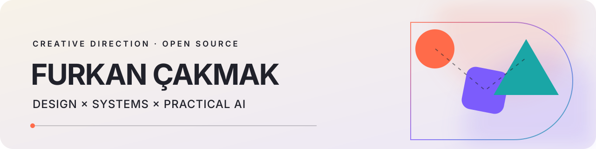

<picture>
  <source media="(prefers-color-scheme: dark) and (max-width: 600px)" srcset="./assets/header-mobile-dark.svg">
  <source media="(prefers-color-scheme: light) and (max-width: 600px)" srcset="./assets/header-mobile-light.svg">
  <source media="(prefers-color-scheme: dark)" srcset="./assets/header-dark.svg">
  <source media="(prefers-color-scheme: light)" srcset="./assets/header-light.svg">
  
</picture>

# Hi, I'm Furkan Çakmak.

I run [For Creative Works](https://www.forcreativeworks.com) in İzmir. My background is in graphic design, photography, and Turkish folk music.

This is where I put the small tools I build for my own work.

## Current project

- **[notebooklm-curator](https://github.com/furkancakmakcreative/notebooklm-curator):** an MCP server that audits NotebookLM source libraries and removes stale sources through browser automation.

## Creative work

- **[For Creative Works](https://www.forcreativeworks.com):** branding, graphic design, photography, and content.
- **[Behance](https://www.behance.net/furkancakmak):** identity and editorial design, plus portrait, event, and concert photography.

## Tools I use

`Photoshop` · `Illustrator` · `Lightroom` · `JavaScript` · `Node.js`

## Links

